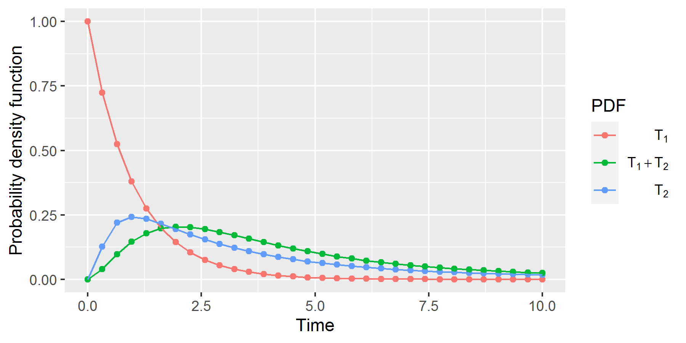
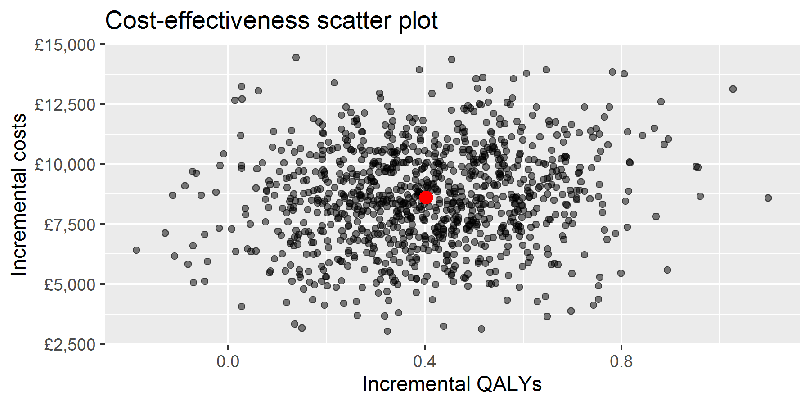
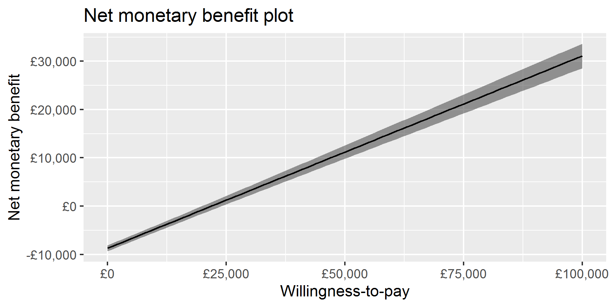
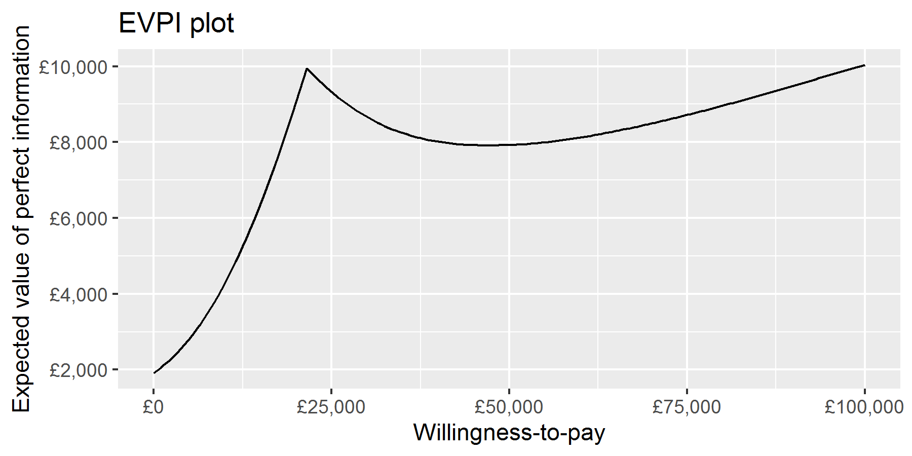
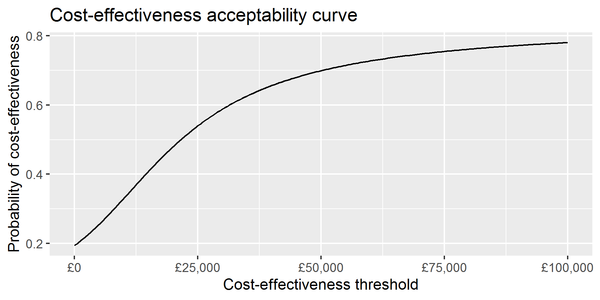
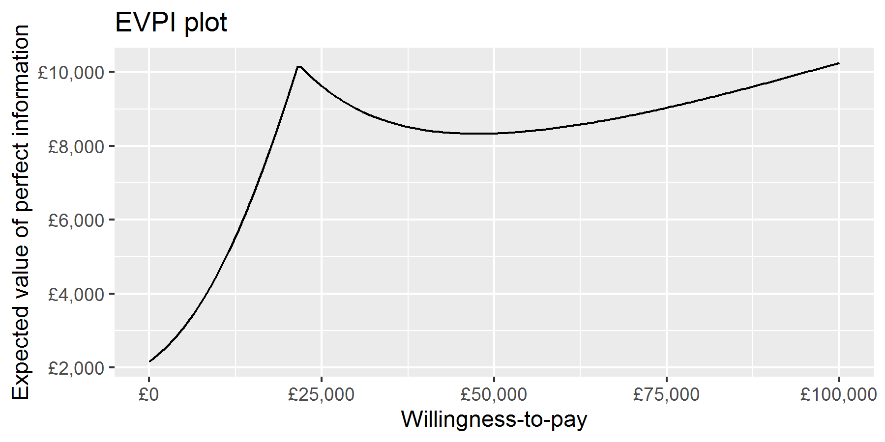

## Topics

> - Alternatives to existing cohort simulation and microsimulation approaches
> - Alternative to Monte Carlo probabilistic sensitivity analysis

---

## Model-based health economic evaluations

We want to evaluate the costs and benefits of two or more healthcare
technologies

We don't have the ability to measure these over the required time horizon
so we will use modelling

We frequently identify a finite number of discrete health states and events
which lead to changes in (transitions between) these health states

---

## Markov cohort simulation

Many health economic models use Markov cohort simulations characterised by

- Discrete time steps (cycles)
- Finite mutually exclusive and collectively exhaustive health states
- Transition probabilities are unchanging or related to *system time*


<iframe src="./fig01.html" allowtransparency="true"> </iframe>

---

## Time in state transition models

- System / model / wall time: How long since the model started?
  - System time + age at start (if constant) = Age now
- Sojourn time: How long have I been in *this* state

--- &twocol

## Both can be useful

*** =left
### System time

- General mortality
- Incidence of disease
- Baseline health-related quality of life (declines with age)

*** =right
### Sojourn time

- Medical management
- Disease progression
- Disease fatality

---

## Sojourn time in Markov cohort simulation

We generally do not know how many cycles an &ldquo;individual&rdquo; has spent
in a state

If we need to know this we change the model structure by adding tunnel states


<iframe src="./fig02.html" allowtransparency="true"> </iframe>

---

## Issues with tunnel states

1. Tunnel states increase computational complexity

    To illustrate, if we have a model with tunnel states and want to halve the
    cycle length, the number of cycles doubles **and** the number of tunnel
    states doubles

2. We either need to set a limit on the amount of sojourn time-dependence the
model can represent, or we need to have as many tunnel states as cycles

---

## Alternatives to tunnel states

- Individual patient simulation (Markov microsimulation, Discrete Event
Simulation, agent-based models, etc.)
- Partitioned survival approach
- Payoff method
- **Moment-generating function (MGF) method**
- **Fast Fourier transform (FFT) method**

---

## Model specification

The MGF and FFT methods are state transition cohort simulation methods

Instead of describing state transitions by transition probabilities we use
(conditionally independent) time-to-event distributions

Competing risks are represented by multiple transitions out of a single state,
with the earliest time-to-event random variable deciding which event takes
place


<iframe src="./fig03.html" allowtransparency="true"> </iframe>

---

## Convolution integrals

The reason it is hard to include sojourn time is that it leads to convolution
integrals. The probability density function for the sum of two independent
variables $X$ and $Y$ is:

\[
  (f_X \ast f_Y)(t) = \int_{-\infty}^{\infty}{f_X(s)f_Y(t-s) \mathrm{d}s}
\]

Or if $f_X(t)$ and $g_X(t)$ are zero when $t < 0$ (as is the case for time-to-event
variables):

\[
  (f_X \ast f_Y)(t) = \int_{0}^{t}{f_X(s)f_Y(t-s)\mathrm{d}s}
\]

When you need to evaluate this for multiple values of $t$ it is challenging
using standard numerical methods

---

## Convolution with integral transforms

Convolution is difficult in the *time domain* but is easy in the Laplace and
frequency domains

\[
\begin{aligned}
  \mathcal{L}\{f \ast g\} &= \mathcal{L}f \cdot \mathcal{L}g \\
  \mathcal{F}\{f \ast g\} &= \mathcal{F}f \cdot \mathcal{F}g
\end{aligned}
\]

Laplace transform of a function $f(t)$ defined for $t \ge 0$:

\[
  \mathcal{L}\{f\}(s) \mathrel{\mathop:}= \int_{0}^{\infty}{f(t)e^{-st}\mathrm{d}t}
\]

Fourier (frequency) transform:

\[
  \mathcal{F}\{f\}(\theta) \mathrel{\mathop:}= \int_{-\infty}^{\infty}{f(t) e^{-(i \theta)t}\mathrm{d}t}
\]

(where $i^2 = -1$)

---

## Laplace transform of probability density functions

If we have a random variable, $T$, the moment-generating function for $T$ is
defined as:

\[
  M_T (s) \mathrel{\mathop:}= \mathbb{E}\left[e^{sT}\right]
\]

And if $T \ge 0$, and has a probability density function $f(t)$, then

\[
  M_T(-s) = \mathbb{E}\left[e^{-sT}\right] = \int_{0}^{\infty}{f(t)e^{-st}\mathrm{d}t} = \mathcal{L}\{f\}(s)
\]

So the moment-generating function for the sum of independent random variables
is the product of their individual moment-generating functions

---

## Fourier transforms of probability density functions

The Fourier transform of a probability density function is its characteristic
function and has the same property

---

## Using moment-generating functions in state transition modelling

Let&apos;s imagine a *very* simple model with just two states, `alive` and
`dead`, and let $T$ be the time-to-event variable for death

The life years lived is a function of random variables:

\[
  \int_0^T{1\,\mathrm{d}t} = T
\]

and the expected life years lived is:

\[
  \mathbb{E}\left[T\right]
\]

---

## Using moment-generating functions in state transition modelling

Now imagine we want to know the *discounted* life years lived:

\[
  \int_0^T{e^{-rt}\mathrm{d}t} = \frac{1-e^{-rT}}{r}
\]

The expected discounted life years lived is then:

\[
  \mathbb{E}\left[\frac{1-e^{-rT}}{r}\right] = \frac{1-\mathbb{E}\left[e^{-rT}\right]}{r}
  = \frac{1 - M_T (-r)}{r}
\]

i.e., we can evaluate the moment-generating function at a single point
($s = -r$) to calculate the expected discounted life years.

Note: We are using $e^{-rt}$ as a discount function rather than $(1+R)^{-t}$
but these are equivalent when $r = \ln(1+R)$

---

## Using moment-generating functions in state transition modelling

Let&apos;s now consider a three state model

States:

- Stable disease
- Progressive disease
- Dead

Events:

- $T_1$: disease progression
- $T_2$: death post-progression

For now, it is not possible to die from the Stable disease state

---

## Using moment-generating functions in state transition modelling

Now (expected) (discounted) life years are given by:

\[
\begin{aligned}
  \mathrm{LY} &= \int_{0}^{T_1+T_2}{1\,\mathrm{d}t} \\ &= T_1 + T_2 \\
  \mathbb{E}\left[\mathrm{LY}\right] &= \mathbb{E}\left[T_1\right] + \mathbb{E}\left[T_2\right] \\
  \mathrm{LY_d} &= \int_0^{T_1+T_2}{e^{-rt}\mathrm{d}t} \\ &= \frac{1 - e^{-r(T_1+T_2)}}{r} \\
  \mathbb{E}\left[\mathrm{LY_d}\right] &= \frac{1 - \mathbb{E}\left[e^{-r(T_1+T_2)}\right]}{r} \\
  &= \frac{1 - M_{X_1+X_2}(-r)}{r} \\
  &= \frac{1 - M_{X_1}(-r) M_{X_2}(-r)}{r}
\end{aligned}
\]

---

## Using moment-generating functions in state transition modelling

We can split the discounted life years lived into those pre-progression and
post-progression simply:

\[
\begin{aligned}
  \mathrm{LY_d} &= \mathrm{PFLY_d} + \mathrm{PPLY_d} \\
  &= \int_0^{T_1}{e^{-rt}\mathrm{d}t} + \int_{T_1}^{T_1+T_2}{e^{-rt}\mathrm{d}t} \\
  \mathbb{E}\left[\mathrm{PFLY_d}\right] &= \frac{1-M_{X_1}(-r)}{r} \\
  \mathbb{E}\left[\mathrm{PPLY_d}\right] &= \frac{M_{X_1}(-r)(1-M_{X_2}(-r))}{r}
\end{aligned}
\]

---

## Using moment-generating functions in state transition modelling

Clearly if we have health states with constant QALY weights and cost accrual
rates (payoffs) we can calculate lifetime discounted costs

We can also easily include one-off costs associated with events:

\[
  \mathbb{E}\left[C\cdot e^{-rT}\right] = C \cdot M_T(-r)
\]

We can also incorporate payoff functions which are exponential or polynomial
in system time or sojourn time (and any linear combinations of these)

Details in: Snowsill T. A new method for model-based health economic evaluation
utilizing and extending moment-generating functions. *Med Decis Making* 2019;
**39**(5): 523&ndash;539

---

## Using moment-generating functions in state transition modelling

What if we can die from the stable disease state?

We incorporate competing risks by:

- Calculating the probabilities of different paths through the model being
taken
- Performing calculations with conditional time-to-event distributions given
the event occurred before other competing risks
- Calculating lifetime discounted outcomes for each of the paths
- Using path probabilities to construct a weighted average

---

## Using FFT in state transition modelling

The fast Fourier transform (FFT) is an efficient algorithm for performing the
discrete Fourier transform (DFT)

If we have a mesh of $2^k$ time points (analogous to time cycles) and the
probability density functions of two time-to-event variables evaluated for
these time points, then:

\[
  [(f_{T_1} \ast f_{T_2})(t)]_{1:2^k} = \left[\frac{T}{2^k}\mathcal{F}^{-1}\left\{
    \mathcal{F}(f_{T_1}(t)_{1:2^k} \mid 0_{1:2^k}) \cdot
    \mathcal{F}(f_{T_2}(t)_{1:2^k} \mid 0_{1:2^k})
  \right\}\right]_{1:2^k}
\]

i.e., to get the probability density function for the sum of $T_1$ and $T_2$ we:

1. Pad the probability density functions to the right with $2^k$ zeroes
2. Use the FFT to calculate the DFT of the results of Step 1
3. Multiply the results of Step 2 together
4. Calculate the inverse FFT of the result of Step 3
5. Scale appropriately and throw away the rightmost $2^k$ values

---

## Using FFT in state transition modelling


<iframe src="fft-d3.html"> </iframe>

---

## Using FFT in state transition modelling


```r
convolute <- function(f, g, T_max) {
  assertthat::are_equal(length(f), length(g))
  N <- length(f)
  return(2*T_max*Re(fft(fft(c(f,rep(0,N))) * fft(c(g,rep(0,N))), inverse = TRUE)[1:N])/(4*N^2))
}
```


```r
sim_FFT <- tibble(
  t = seq(0, 10, length.out = 32),
  f1 = dexp(t),
  f2 = dlnorm(t, meanlog = 1),
  f12 = convolute(f1, f2, 10)
)
```

---

## Using FFT in state transition modelling



---

## Using FFT in state transition modelling

So the FFT can help us to get the probability density functions for sums of
independent random variables

What else?

---

## Using FFT in state transition modelling

### The relationship between convolution and integration

If $f(t) = \frac{\mathrm{d}F(t)}{\mathrm{d}t}$ and $g(t) = \frac{\mathrm{d}G(t)}{\mathrm{d}t}$

\[
  (F \ast g)(t) = (f \ast G)(t) = \int_{-\infty}^t{(f \ast g)(\tau)\mathrm{d}\tau}
\]

Therefore if we want to know the cumulative distribution function for sums of
independent random variables, we use the cumulative distribution function for
*one* of them in the place of the probability density function

---

## Using FFT in state transition modelling

### Fundamental finding

If a quantity, $q$, is accrued while within a state as

\[\frac{\mathrm{d}q}{\mathrm{d}s} = \psi(s)\]

where $s$ is the sojourn time in the state, then:

\[
\frac{\mathrm{d}q}{\mathrm{d}t} = (\psi S \ast \theta)(t)
\]

where:

* $t$ is system time
* $\theta(t)$ is the probability density function for transitions into the state
* $S(s)$ is the survival function for remaining in the state

---

## Using FFT in state transition modelling

For example, if $q$ is life years (LY) lived, then $\psi(s) = 1$ for all states
other than death, so

\[
\frac{\mathrm{d}\mathrm{LY}_i}{\mathrm{d}t} = (S_i \ast \theta_i)(t)
\]

describes the life years lived in state $i$

This is also the state occupancy equation!

---

## Using FFT in state transition modelling

More generally $\psi(s)$ could represent the rate at which a payoff is accrued
as a function of time in the state, e.g., quality of life might be initially
low and costs initially high after undergoing surgery, but these both improve
over time

If payoffs are better described in terms of model time, the framework is still
effective:

\[
\frac{\mathrm{d}q}{\mathrm{d}t} = \psi(t)\left[(S \ast \theta)(t)\right]
\]

---

## Using FFT in state transition modelling

We then integrate $\frac{\mathrm{d}q}{\mathrm{d}t}$ to produce $q(t)$ using
any suitable method, e.g.:

* Euler method (i.e., Markov cohort simulation)
* Trapezoidal method (life-table method)
* Simpson&apos;s rule

---

## Using FFT in state transition modelling

How do we determine $S(s)$ and $\theta(t)$?

$S(s)$ is the product of the survival functions for all transitions out of a
state

$\theta(t)$ is derived from the probability density functions for TTE variables
representing transition paths through the model to the current state
(adjusting for competing events)

Forthcoming paper describes how to derive $\theta(t)$ and how to adjust for
other-cause mortality which is dependent on system time

---

## Propagating uncertainty through decision analytic models: the Delta-PSA method

### Probabilistic sensitivity analysis (PSA)

> What is the impact of uncertainty of model inputs (parameters) on
> *decision uncertainty*?

---

## Propagating uncertainty through decision analytic models: the Delta-PSA method

### Monte Carlo PSA (MC-PSA)

1. Repeatedly sample parameter values $\pmb{\theta}_i$ from joint distribution for
parameters
2. Run the model for each $\pmb\theta_i$ to get outcomes $\mathbf{y}_i$
3. Analyse the distribution of $\mathbf{y}_i$ in some way to understand decision uncertainty

---

## Propagating uncertainty through decision analytic models: the Delta-PSA method



---

## Propagating uncertainty through decision analytic models: the Delta-PSA method


---

## Propagating uncertainty through decision analytic models: the Delta-PSA method



---

## Propagating uncertainty through decision analytic models: the Delta-PSA method



---

## Propagating uncertainty through decision analytic models: the Delta-PSA method

### The Delta-PSA ($\Delta$-PSA) method

Treat the model as a function

\[
  \mathbf{y} = \mathbf{g}(\pmb\theta) =
  \begin{bmatrix}
    g_1(\pmb{\theta}) \\
    \vdots \\
    g_m(\pmb{\theta}) \\
  \end{bmatrix}
\]

And use Taylor series approximations to estimate $\mathbb{E}\mathbf{g}(\pmb{\theta})$
and $\operatorname{Var}[\mathbf{g}(\pmb{\theta})]$ given the expected value and variance
of $\pmb\theta$

\[
\begin{aligned}
  \mathbb{E}g_k(\pmb\theta) &\approx g_k(\mathbb{E}\pmb\theta) + \frac{1}{2}\operatorname{tr}\left(H_k(\mathbb{E}\pmb\theta) \cdot \Sigma_\theta\right) \\
  \operatorname{Var}[\mathbf{g}(\pmb\theta)] &\approx J \cdot \Sigma_\theta \cdot J^\top
\end{aligned}
\]

Where $J$ is the Jacobian matrix $\frac{\partial \mathbf{g}}{\partial\pmb\theta}$
and $H_k$ are the Hessian matrices $\frac{\partial^2 g_k}{\partial\pmb\theta^2}$

---

## Propagating uncertainty through decision analytic models: the Delta-PSA method

Let $g_1(\pmb\theta)$ be incremental costs and $g_2(\pmb\theta)$ be incremental
benefits, and let $\hat\mu_g = \begin{bmatrix}\hat\mu_1 \\ \hat\mu_2\end{bmatrix}$
and $\hat\Sigma_g = \begin{bmatrix} \hat\sigma_{11} & \hat\sigma_{12} \\
\hat\sigma_{21} & \hat\sigma_{22}\end{bmatrix}$ be the estimated mean and
variance of
$\mathbf{g}(\pmb\theta) = \begin{bmatrix}g_1(\pmb\theta) \\ g_2(\pmb\theta)\end{bmatrix}$.

Then the expected value, $m(\lambda)$, and standard deviation, $s(\lambda)$,
of the distribution of incremental net monetary benefit at WTP $\lambda$ are:

\[
\begin{aligned}
  m(\lambda) &= -\hat\mu_1 + \lambda \hat\mu_2 \\
  s(\lambda) &= \sqrt{\lambda^2 \hat\sigma_{22} - 2\lambda \hat\sigma_{12} + \hat\sigma_{11}}
\end{aligned}
\]

---
\[
  \mathrm{CEAC}(\lambda) = \Phi\left(\frac{m(\lambda)}{s(\lambda)}\right)
\]



---
\[
\begin{aligned}
  \mathrm{EVPI}(\lambda) &= \mathbb{E}\left\{\left|\mathrm{INMB}(\lambda)\right|\right\} -
  \left|\mathbb{E}\left\{\mathrm{INMB}(\lambda)\right\}\right| \\
  &= \left\{s(\lambda)\sqrt{\frac{2}{\pi}}e^\left(-{m(\lambda)^2}/{2s(\lambda)^2}\right) - m(\lambda)\left(1 - 2 \Phi\left(\frac{m(\lambda)}{s(\lambda)}\right)\right)\right\} -
  \left|m(\lambda)\right|
\end{aligned}
\]



---
## Propagating uncertainty through decision analytic models: the Delta-PSA method

How do we find the derivatives of model outputs with respect to inputs?

* Markov cohort simulation: product rule for differentiation
* MGF/FFT methods: Leibniz rule

**Note:** The method will work best when the joint distribution of parameters
and joint distribution of outputs are (approximately) multivariate normal (so
use log and other transformations)

---

## Propagating uncertainty through decision analytic models: the Delta-PSA method

### Markov cohort simulation

* State membership vector:
$\mathbf{x}_t(\pmb\theta) = \begin{bmatrix} x_{1t}(\pmb\theta) & \ldots & x_{kt}(\pmb\theta)\end{bmatrix}^\top$
* Transition matrix: $P_t(\pmb\theta)$
* Value vector (single outcome) $\mathbf{v}_t(\pmb\theta)$ or matrix (multiple outcomes) $V_t(\pmb\theta)$ (can include discounting, half-cycle correction)
* Markov model evolution: $\mathbf{x}_t(\pmb\theta) = P_{t-1}(\pmb\theta)^\top \mathbf{x}_{t-1}(\pmb\theta)$
* Accumulation of payoffs (single outcome for simplicity): $g(\pmb\theta) = \sum_{t=0}^T{g_t(\pmb\theta)} = \sum_{t=0}^T{\mathbf{v}_t(\pmb\theta)^\top \mathbf{x}_t(\pmb\theta)}$

---
## Propagating uncertainty through decision analytic models: the Delta-PSA method

### Markov cohort simulation

First derivatives:

\[
\begin{aligned}
\frac{\partial g}{\partial \theta_i} &= \sum_{t=0}^T{\frac{\partial g_t}{\partial \theta_i}} \\
  \frac{\partial g_t}{\partial\theta_i} &= \frac{\partial\mathbf{v}_t^\top}{\partial\theta_i} \mathbf{x}_t + \mathbf{v}_t^\top \frac{\partial\mathbf{x}_t}{\partial\theta_i} \\
\frac{\partial\mathbf{x}_t}{\partial\theta_i} &= 
  \frac{\partial P_{t-1}^\top}{\partial\theta_i} \mathbf{x}_{t-1} + P_{t-1}^\top \frac{\partial\mathbf{x}_{t-1}}{\partial\theta_i}
\end{aligned}
\]

---
## Propagating uncertainty through decision analytic models: the Delta-PSA method

### Markov cohort simulation

Second derivatives:

\[
\frac{\partial^2 g_t}{\partial \theta_i \partial\theta_j}
= \mathbf{v}_t^\top \frac{\partial^2 \mathbf{x}_t}{\partial\theta_i \partial\theta_j} + \frac{\partial\mathbf{v}_t^\top}{\partial\theta_i}\frac{\partial\mathbf{x}_t}{\partial\theta_j} + \frac{\partial\mathbf{v}_t^\top}{\partial\theta_j}\frac{\partial\mathbf{x}_t}{\partial\theta_i} + \frac{\partial^2\mathbf{v}_t^\top}{\partial\theta_i \partial\theta_j}\mathbf{x}_t
\]
\[
\frac{\partial^2 \mathbf{x}_t }{\partial\theta_i \partial\theta_j} = \frac{\partial^2 P_{t-1}^\top}{\partial\theta_i \partial\theta_j} \mathbf{x}_{t-1} + \frac{\partial P_{t-1}^\top}{\partial\theta_i}\frac{\partial \mathbf{x}_{t-1}}{\partial\theta_j} + \frac{\partial P_{t-1}^\top}{\partial\theta_j}\frac{\partial \mathbf{x}_{t-1}}{\partial\theta_i} + P_{t-1}^\top \frac{\partial^2 \mathbf{x}_{t-1}}{\partial\theta_i \partial\theta_j}
\]

---
## Propagating uncertainty through decision analytic models: the Delta-PSA method

> We derive Markov recurrence relations for the first and second derivatives
> analogous to the standard Markov recurrence relation (require use of
> multi-dimensional arrays, so not well suited to spreadsheets)

> Check out presentation 13470 at SMDM20 to see a full demo with Markov cohort
> simulation based on hip replacement model in Briggs et al. handbook

---
## Propagating uncertainty through decision analytic models: the Delta-PSA method

### Leibniz rule

Under certain conditions:

\[
  \frac{\mathrm{d}}{\mathrm{d}\theta}\left(\int_0^\infty{f(\theta,t)\,\mathrm{d}t}\right)
  = \int_0^\infty{\frac{\partial}{\partial\theta}f(\theta,t)\,\mathrm{d}t}
\]

This means that if we have used numerical methods (e.g., Gaussian quadrature
or FFT) to calculate $\int_0^\infty{f(\theta,t)\,\mathrm{d}t}$, we can also
use numerical methods to calculate
$\int_0^\infty{\frac{\partial}{\partial\theta}f(\theta,t)\,\mathrm{d}t}$

Also, symbolic differentiation is something computer algebra systems (e.g., in
R and Python) are good at!

---
## Propagating uncertainty through decision analytic models: the Delta-PSA method

### EVPPI / EVSI

Currently working on these!

If we do not change $\mathbb{E}\pmb\theta$ but only
$\operatorname{Var}[\pmb\theta]$, then we can see the effect of reduced
uncertainty about some/all parameters very simply

$J$ and $H_k$ do not change, we just change $\Sigma_\theta$ in

\[
\begin{aligned}
  \mathbb{E}g_k(\pmb\theta) &\approx g_k(\mathbb{E}\pmb\theta) + \frac{1}{2}\operatorname{tr}\left(H_k(\mathbb{E}\pmb\theta) \cdot \Sigma_\theta\right) \\
  \operatorname{Var}[\mathbf{g}(\pmb\theta)] &\approx J \cdot \Sigma_\theta \cdot J^\top
\end{aligned}
\]

This suggests it *may* be possible to accelerate VOI calculations (beyond
removing the need for the &ldquo;inner loop&rdquo; of MC-PSA)

---

## Concluding remarks

> * Sojourn-dependent transitions and payoffs are tricky in standard cohort
simulation because convolutions are difficult in the time domain

> * Convolutions are easy in the Laplace (MGF) and frequency (FFT) domains

> * The FFT should be a valuable addition to any modeller&apos;s toolbox

> * There is an analytical alternative to Monte Carlo PSA which may enable
more efficient exploration of uncertainty and the value of information


---

## Details

### MGF method

Snowsill T. A new method for model-based health economic evaluation
utilizing and extending moment-generating functions. *Med Decis Making* 2019;
**39**(5): 523&ndash;539

### FFT method

Submitted to *Med Decis Making* &ndash; Reject and resubmit!

### Delta-PSA method

Accepted at SMDM October 2020 (abstract 13470: Propagation of Uncertainty
through Economic Models Using Taylor Series Approximations: The Delta-PSA
(Δ-PSA) Method)
